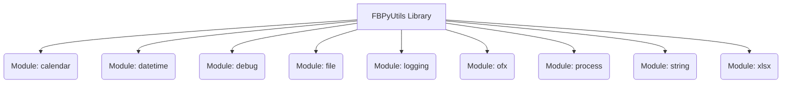

# FBPyUtils Library Specification

## 1. Introduction

This document formally defines the specifications and design of the `fbpyutils` Python library. It serves as a comprehensive reference for its development, maintenance, and future enhancements. The library aims to provide a collection of utility functions and classes to streamline common programming tasks in Python, focusing on reusability, efficiency, and maintainability.

## 2. Architecture Overview

The `fbpyutils` library is structured into several modules, each encapsulating related functionalities. The design emphasizes modularity, allowing for independent development and testing of components. Key architectural principles include:

*   **Modularity:** Separation of concerns into distinct Python modules (e.g., `calendar`, `datetime`, `file`, `process`, `string`, `xlsx`, `ofx`, `logging`, `debug`).
*   **Reusability:** Functions and classes are designed to be generic and easily integrated into various projects.
*   **Maintainability:** Clear code structure, consistent naming conventions, and comprehensive documentation.
*   **Extensibility:** The architecture allows for easy addition of new utility functions or modules without significantly impacting existing components.



## 3. Module Specifications

This section outlines the purpose and key functionalities of each module within the `fbpyutils` library.

### 3.1. `calendar.py`
*   **Purpose:** Provides utilities for calendar-related operations, such as generating date ranges and adding markers to calendar data.
*   **Key Functions/Classes:**
    *   `get_calendar(start_date, end_date)`: Generates a list of dates within a specified range.
    *   `add_markers(calendar_data)`: Adds specific markers (e.g., holidays, weekends) to calendar entries.
    *   `calendarize()`: (Further details to be added)

### 3.2. `datetime.py`
*   **Purpose:** Offers functions for advanced date and time manipulations, including delta calculations and timezone applications.
*   **Key Functions/Classes:**
    *   `delta(dt1, dt2, unit)`: Calculates the difference between two datetime objects in specified units.
    *   `apply_timezone(dt, tz)`: Applies a given timezone to a datetime object.
    *   `elapsed_time(dt1, dt2)`: Calculates the elapsed time between two datetime objects.

### 3.3. `debug.py`
*   **Purpose:** Contains decorators and utilities for debugging purposes, aiding in development and troubleshooting.
*   **Key Functions/Classes:**
    *   `debug(func)`: A decorator to enable debugging for a function.
    *   `debug_info(exception)`: Provides detailed information about an exception.

### 3.4. `file.py`
*   **Purpose:** Provides a comprehensive set of utilities for file system operations, including file searching, reading, writing, and metadata retrieval.
*   **Key Functions/Classes:**
    *   `find(path, mask)`: Searches for files matching a pattern.
    *   `creation_date(file_path)`: Retrieves the creation date of a file.
    *   `load_from_json(file_path)`: Loads data from a JSON file.
    *   `write_to_json(data, file_path)`: Writes data to a JSON file.
    *   `contents(file_path)`: Reads the raw contents of a file.
    *   `mime_type(file_path)`: Determines the MIME type of a file.
    *   `build_platform_path(...)`: Constructs a platform-specific file path.
    *   `absolute_path(file_path)`: Returns the absolute path of a file.
    *   `describe_file(file_path)`: Provides detailed information about a file.
    *   `get_file_head_content(...)`: Retrieves the head content of a file.

### 3.5. `logging.py`
*   **Purpose:** Manages logging configurations for the library, ensuring consistent and effective log output.
*   **Key Functions/Classes:**
    *   `setup_logging()`: Configures the logging system for the library.

### 3.6. `ofx.py`
*   **Purpose:** Offers functionalities for parsing and processing OFX (Open Financial Exchange) files.
*   **Key Functions/Classes:**
    *   `format_date(dt, native)`: Formats a datetime object for OFX.
    *   `read(ofx_content, native_date)`: Reads and parses OFX content.
    *   `read_from_path(file_path, native_date)`: Reads and parses an OFX file from a given path.
    *   `main(argv)`: Main entry point for OFX processing (likely for CLI usage).

### 3.7. `process.py`
*   **Purpose:** Provides robust mechanisms for parallel processing and controlled execution of functions, including file-based and session-based control.
*   **Key Functions/Classes:**
    *   `ProcessingFunction` (Protocol): Defines the interface for processing functions.
    *   `ProcessingFilesFunction` (Protocol): Defines the interface for file processing functions.
    *   `Process` (Class): Base class for managing function execution, with parallelization options.
        *   `get_available_cpu_count()`: Returns the number of available CPUs.
        *   `is_parallelizable(parallel_type)`: Checks if parallelization is possible.
        *   `get_function_info(func)`: Retrieves information about a function.
        *   `run(params)`: Executes functions with given parameters.
    *   `FileProcess` (Class): Extends `Process` for file-controlled execution.
        *   `_controlled_run(...)`: Internal method for controlled file processing.
        *   `run(params, controlled)`: Executes file processing with optional control.
    *   `SessionProcess` (Class): Extends `Process` for session-controlled execution.
        *   `generate_session_id()`: Generates a unique session ID.
        *   `generate_task_id(params)`: Generates a unique task ID based on parameters.
        *   `_controlled_run(...)`: Internal method for controlled session processing.
        *   `run(params, session_id, controlled)`: Executes session processing with optional control.

### 3.8. `string.py`
*   **Purpose:** Contains various utilities for string manipulation, including UUID generation, similarity comparison, hashing, and normalization.
*   **Key Functions/Classes:**
    *   `uuid()`: Generates a UUID.
    *   `similarity(s1, s2, method)`: Calculates string similarity.
    *   `random_string(...)`: Generates a random string.
    *   `json_string(data)`: Converts a dictionary to a JSON string.
    *   `hash_string(s)`: Hashes a string.
    *   `hash_json(data)`: Hashes a JSON object.
    *   `normalize_value(...)`: Normalizes a given value.
    *   `translate_special_chars(s)`: Translates special characters in a string.
    *   `normalize_names(names, normalize_specials)`: Normalizes a list of names.
    *   `split_by_lengths(string, lengths)`: Splits a string by specified lengths.

### 3.9. `xlsx.py`
*   **Purpose:** Provides functionalities for reading from and writing to Excel (XLSX) files.
*   **Key Functions/Classes:**
    *   `ExcelWorkbook` (Class): Represents an Excel workbook.
        *   `__init__(xl_file)`: Initializes the workbook.
        *   `read_sheet(sheet_name)`: Reads data from a specified sheet.
        *   `read_sheet_by_index(index)`: Reads data from a sheet by its index.
    *   `get_sheet_names(xl_file)`: Retrieves sheet names from an Excel file.
    *   `get_sheet_by_name(...)`: Gets a specific sheet by name.
    *   `get_all_sheets(...)`: Gets all sheets from an Excel file.
    *   `write_to_sheet(...)`: Writes data to an Excel sheet.

## 4. Code Conventions

This section outlines the coding conventions to be followed for the `fbpyutils` library to ensure consistency, readability, and maintainability.

*   **Language:** All code and documentation must be in English.
*   **Formatting:** Adherence to PEP 8 guidelines for Python code.
*   **Naming Conventions:**
    *   Modules: lowercase_with_underscores (e.g., `file.py`).
    *   Functions: lowercase_with_underscores (e.g., `get_calendar`).
    *   Classes: CapWords (e.g., `ExcelWorkbook`).
    *   Variables: lowercase_with_underscores.
    *   Constants: ALL_CAPS_WITH_UNDERSCORES.
*   **Docstrings:** All public modules, classes, and functions must have comprehensive docstrings following the Google style guide.
*   **Type Hinting:** Extensive use of type hints for function arguments and return values to improve code clarity and enable static analysis.
*   **Error Handling:** Robust error handling mechanisms using try-except blocks where appropriate.
*   **Imports:** Imports should be organized according to PEP 8 (standard library, third-party, local application).

## 5. Testing Strategy

This section describes the approach to testing the `fbpyutils` library to ensure its reliability and correctness.

*   **Unit Tests:** Each function and method should have dedicated unit tests covering various scenarios, including edge cases.
*   **Integration Tests:** Tests that verify the interaction between different modules and components.
*   **Test Framework:** `pytest` will be used as the primary testing framework.
*   **Coverage:** Aim for high test coverage to ensure all critical parts of the codebase are tested.

## 6. Documentation Guidelines

This section provides guidelines for maintaining and extending the documentation of the `fbpyutils` library.

*   **ReadMe:** The `README.md` file should provide a concise overview of the library, installation instructions, and basic usage examples.
*   **API Reference:** Detailed API documentation generated from docstrings (e.g., using Sphinx).
*   **Examples:** Provide clear and runnable examples for key functionalities.
*   **Contribution Guide:** A guide for contributors outlining how to set up the development environment, run tests, and submit changes.

## 7. Future Considerations

This section outlines potential future enhancements and considerations for the `fbpyutils` library.

*   **Performance Optimization:** Identify and optimize performance-critical sections of the code.
*   **New Modules:** Explore the addition of new utility modules based on common needs (e.g., network utilities, data validation).
*   **Dependency Management:** Regularly review and update external dependencies.
*   **CI/CD Integration:** Implement continuous integration and continuous deployment pipelines for automated testing and releases.

## 8. Client Implementation Guidance for Logging

External clients can configure the `fbpyutils` logging system by providing an `app.json` file within the `fbpyutils/` directory (e.g., `fbpyutils/app.json`) and utilizing the `Env` class.

### 8.1. `app.json` Configuration

Create an `app.json` file in the `fbpyutils/` directory with a `logging` section. This section allows you to specify the desired `log_level`, `log_format`, and `log_file_path`.

**Example `fbpyutils/app.json`:**

```json
{
  "app": {
    "name": "YourAppName",
    "version": "1.0.0",
    "environment": "dev",
    "appcode": "YOURAPPCODE",
    "year": 2025
  },
  "logging": {
    "log_level": "DEBUG",
    "log_format": "%(asctime)s - %(levelname)s - %(name)s - %(message)s",
    "log_file_path": "logs/your_app.log"
  }
}
```

*   **`log_level`**: (Optional) Specifies the minimum level of messages to log (e.g., "DEBUG", "INFO", "WARNING", "ERROR", "CRITICAL"). Defaults to "INFO" if not provided or if the environment variable `LOG_LEVEL` is not set.
*   **`log_format`**: (Optional) Defines the format of the log messages. Defaults to `"%(asctime)s - %(name)s - %(levelname)s - %(message)s"` if not provided.
*   **`log_file_path`**: (Optional) Specifies the path to the log file. If provided, logs will be written to this file. If not provided, logs will default to a file within the user's application folder (e.g., `~/.fbpyutils/fbpyutils.log`). This path can be absolute or relative to the project root.

### 8.2. `Env` Class Usage

The `fbpyutils` library automatically loads the `app.json` file and initializes the `Env` class, which then configures the global logging system. You do not need to explicitly call `Logger.configure()` unless you want to reconfigure the logging system at runtime with a different configuration dictionary.

The `Env` class prioritizes configuration values in the following order:
1.  Environment variables (e.g., `LOG_LEVEL`).
2.  Values from the `fbpyutils/app.json` dictionary.
3.  Default values defined within the `Env` class.

To access environment variables or logging settings, you can import `Env` and `Logger` from `fbpyutils`:

```python
from fbpyutils import Env, Logger

# Access application configuration
app_name = Env.APP['name']
log_level = Env.LOG_LEVEL
log_file = Env.LOG_FILE

# Use the logger
Logger.log(Logger.INFO, f"Application '{app_name}' started with log level: {log_level}")
Logger.log(Logger.DEBUG, f"Logs are being written to: {log_file}")
```

This setup ensures that clients can easily customize the logging behavior of `fbpyutils` to fit their specific application requirements.
