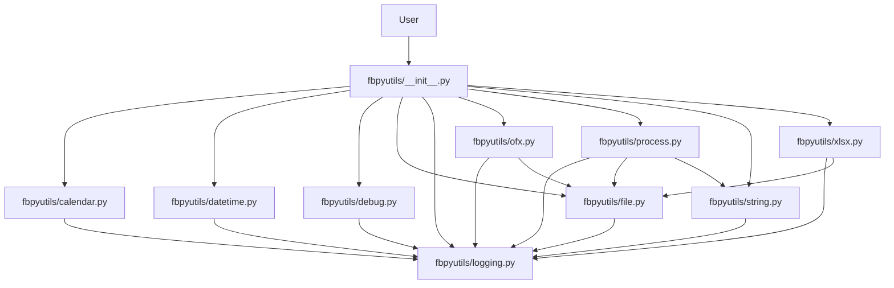

# System Patterns

This document describes the system architecture, key technical decisions, design patterns in use, component relationships, and critical implementation paths. It provides a high-level overview of how the system is structured and operates.

## Architecture Overview
`fbpyutils` is designed as a **monolithic utility library**, organized into distinct modules, each responsible for a specific set of functionalities (e.g., `file`, `datetime`, `string`, `ofx`, `xlsx`, `process`, `calendar`, `debug`, `logging`). This modular approach promotes high cohesion within modules and low coupling between them.

## Key Technical Decisions
- **Python as Core Language:** Chosen for its versatility, extensive ecosystem, and readability, making it suitable for a wide range of utility functions.
- **Modular Design:** Each functional area is encapsulated in its own Python module (`.py` file) within the `fbpyutils` package. This enhances maintainability and allows users to import only necessary components.
- **Type Hinting:** Extensive use of type hints (`typing` module) for improved code readability, maintainability, and static analysis, reducing runtime errors.
- **Comprehensive Testing with Pytest:** `pytest` is used for unit and integration testing, ensuring high code quality and reliability. `pytest-cov` is used for coverage analysis, enforcing a minimum of 90% coverage.
- **Global Logging System:** A centralized, rotating file-based logging system (`fbpyutils.logging`) is implemented to provide consistent and manageable logging across all modules.
- **Dependency Management with `uv`:** `uv` is used for efficient and reliable package management, ensuring consistent environments for development and deployment.
- **Platform Agnostic Design:** Where applicable (e.g., file path handling), functions are designed to work across different operating systems (Windows, Linux, macOS).

## Design Patterns in Use
- **Module Pattern:** Each `.py` file acts as a module, encapsulating related functions and classes.
- **Decorator Pattern:** Used in the `debug` module (`@debug`) to add debugging functionality to functions non-invasively.
- **Singleton Pattern (Implicit for Logger):** The global logger instance, once configured, acts as a singleton, providing a single point of access for logging across the application.
- **Strategy Pattern (Implicit in `Process` classes):** The `Process`, `FileProcess`, and `SessionProcess` classes allow different processing strategies (parallel/serial, controlled/uncontrolled) to be applied to tasks.

## Component Relationships

*Note: The `__init__.py` currently does not explicitly import all modules, but they are accessible via `fbpyutils.<module_name>`. The diagram shows the conceptual relationship.*

## Critical Implementation Paths
- **File I/O Operations:** Functions in `fbpyutils.file` and `fbpyutils.xlsx` are critical as they interact directly with the file system, requiring robust error handling and platform compatibility.
- **Process Execution:** The `fbpyutils.process` module, especially its parallel execution capabilities, is critical for performance-sensitive tasks and requires careful management of threads/processes.
- **OFX Parsing:** The `fbpyutils.ofx` module's ability to correctly parse and interpret OFX data is crucial for financial data integration.
- **Logging System Initialization:** The `setup_logging` function in `fbpyutils.logging` is a critical initialization path, as it configures the central logging mechanism for the entire library.

## Data Flow
Data typically flows into `fbpyutils` functions as input parameters (strings, numbers, file paths, DataFrames) and is processed to produce transformed data, calculated values, or modified files as output. For file-based operations, data is read from the file system, processed in memory, and then potentially written back to the file system. The logging system captures execution details and writes them to a dedicated log file.

## Error Handling Strategy
- **Exception Handling:** Functions use `try-except` blocks to gracefully handle expected errors (e.g., `FileNotFoundError`, `ValueError`, `TypeError`).
- **Logging Errors:** Critical errors are logged using the global logging system (`logger.error`, `logger.exception`) to provide detailed context for debugging.
- **Return Values:** Functions often return `None` or empty data structures (e.g., empty lists, dictionaries) in case of errors, allowing calling code to check for successful execution.
- **Specific Error Messages:** Error messages are designed to be informative, guiding the user or developer to the root cause of the issue.

## Security Considerations
- **File Path Sanitization:** While not explicitly implemented as a security feature, careful handling of file paths is crucial to prevent directory traversal vulnerabilities. Users are expected to provide valid and safe paths.
- **Input Validation:** Basic input validation is performed where necessary (e.g., checking `output_format` in `get_file_head_content`).
- **No Direct Shell Execution (Generally):** The library avoids direct shell command execution where possible, reducing the risk of command injection vulnerabilities. The `process` module uses Python's `concurrent.futures` for parallelism, not direct shell calls.
- **Hashing for Integrity:** Hashing functions (e.g., `md5sum`, `sha256`) are provided for data integrity checks, though not directly for security (e.g., password storage).

## Scalability and Performance
- **Parallel Processing:** The `fbpyutils.process` module supports parallel execution using threads or processes, allowing for improved performance on multi-core systems for CPU-bound or I/O-bound tasks.
- **Efficient File I/O:** Functions are designed to handle file operations efficiently, minimizing memory footprint where possible (e.g., reading file heads).
- **Optimized String Operations:** String manipulation functions are implemented with performance in mind.
- **Lazy Loading (Implicit):** Modules are only loaded when imported, contributing to faster startup times if only a subset of utilities is needed.

## Date Created
2023-10-27

## Last Updated
2025-05-31
